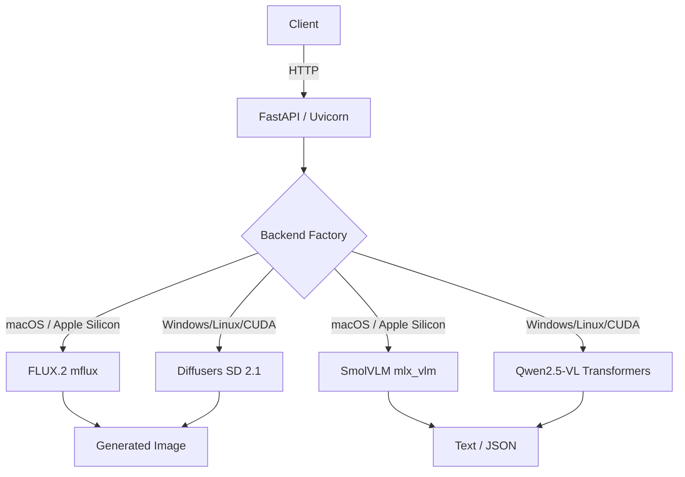

# Local Vision AI

<p align="center">
  
</p>

<p align="center">
  <strong>Production-structured local multimodal AI</strong><br>
  Text-to-Image and Image-to-Text on Apple Silicon, Windows, and Linux
</p>

<p align="center">
  <a href="#installation">Install</a> •
  <a href="#desktop-app">Desktop App</a> •
  <a href="#cli-usage">CLI</a> •
  <a href="#api">API</a> •
  <a href="#releases">Download</a>
</p>

---

## What is Local Vision AI?

Local Vision AI runs entirely on your device — no cloud API keys, no subscription fees, no data leaving your machine.

- **🎨 Text-to-Image** — Generate photorealistic images from prompts using **FLUX.2 [klein] 4B** (via MLX)
- **🔍 Image-to-Text** — Analyze images, caption them, answer visual questions, and extract structured JSON using **SmolVLM 256M** (via MLX-VLM)

Everything runs locally on Apple Silicon, Windows, or Linux.

## Platform Support

| Platform | Hardware | T2I Backend | I2T Backend | Notes |
|----------|----------|-------------|-------------|-------|
| **macOS** | Apple Silicon (M1–M4) | FLUX.2 klein 4B int4 | SmolVLM 256M int4 | Best quality, native MLX |
| **macOS** | Intel | SD 2.1 (Diffusers) | Qwen2.5-VL 3B | Slow, CPU-only |
| **Windows** | NVIDIA GPU (8GB+) | SD 2.1 (Diffusers) | Qwen2.5-VL 3B | CUDA accelerated |
| **Linux** | NVIDIA GPU (8GB+) | SD 2.1 (Diffusers) | Qwen2.5-VL 3B | CUDA accelerated |
| **Any** | CPU only | SD 1.5 (Diffusers) | Phi-3 Vision | Very slow, emergency fallback |

## Quick Start

### Option 1: Download Pre-built Binary (Recommended)

Download the latest release for your platform:

| Platform | Download | Size |
|----------|----------|------|
| **macOS** | [`LocalVisionAI-v0.2.0-macOS.dmg`](https://github.com/minrahim1999/local-vision-ai/releases/latest) | ~62 MB |
| **Windows** | [`LocalVisionAI-v0.2.0-Windows.zip`](https://github.com/minrahim1999/local-vision-ai/releases/latest) | ~60 MB |
| **Linux** | [`LocalVisionAI-v0.2.0-Linux.tar.gz`](https://github.com/minrahim1999/local-vision-ai/releases/latest) | ~55 MB |

Download → Extract → Double-click `LocalVisionAI` (or `LocalVisionAI.app` on macOS). The app auto-starts the API server and opens the GUI.

### Option 2: Install from Source

Requires **uv** (Python package manager) and **git**.

**macOS (Apple Silicon):**
```bash
git clone https://github.com/minrahim1999/local-vision-ai.git
cd local-vision-ai
make setup                    # installs uv deps + mflux + mlx
make download-models          # download model weights (~7 GB)
make run                      # start API server
```

**Windows / Linux (NVIDIA GPU):**
```bash
git clone https://github.com/minrahim1999/local-vision-ai.git
cd local-vision-ai
uv venv --python 3.11
uv pip install -e ".[text_to_image,image_to_text,dev,desktop]"
make download-models
make run
```

Or manually:
```bash
uv venv --python 3.11
uv pip install -e ".[text_to_image,image_to_text,dev,desktop]"
cp .env.example .env
# Edit .env with your preferred settings
```

---

## Architecture



## Screenshots

| 🎨 Generate Image | 🔍 Analyze Image | 📊 System Status |
|---|---|---|
| Enter prompt, set resolution/steps, click Generate | Browse for image, enter prompt, get text/JSON result | Live memory, model loading, and health display |

> *Screenshots coming soon — the app is functional and ready to use.*

---

## Desktop App

A Flet-based desktop GUI is included with three tabs:

- **🎨 Generate Image** — Enter prompt, set resolution/steps, see generated image inline
- **🔍 Analyze Image** — Browse for image, enter prompt, get text/JSON result
- **📊 System Status** — Live memory, model loading, and health display

### Launch Desktop (Development)

```bash
make run-desktop          # requires API running separately
```

Or standalone (API + GUI in one window):
```bash
lvai-standalone
```

### Building Release Binaries

Build `.app` (macOS), `.exe` (Windows), or tarball (Linux):

```bash
# Local build
make build-release VERSION=v0.2.0

# GitHub Actions (all platforms)
git tag v0.2.0
git push origin v0.2.0
```

---

## CLI Usage

The CLI works in two modes:
- **Via API** (default) — sends requests to the running server
- **Direct** (`--no-server`) — loads models locally, no server needed

### Check backends

```bash
lvai-cli backend
```

### Generate image (via API)

```bash
lvai-cli generate "A cat on a sofa" --width 512 --height 512 --seed 1337
```

### Generate image (direct, no server)

```bash
lvai-cli generate "A cat on a sofa" --width 512 --height 512 --no-server
```

### Analyze image (via API)

```bash
lvai-cli analyze photo.jpg --prompt "Describe this image"
```

### Extract JSON (via API)

```bash
lvai-cli extract photo.jpg --prompt "Extract objects and colors as JSON"
```

### Check API health

```bash
lvai-cli health
```

### Makefile CLI shortcuts

```bash
make cli-generate PROMPT="A futuristic robot" WIDTH=512 HEIGHT=512
make cli-analyze IMAGE=photo.jpg PROMPT="Describe this"
make cli-extract IMAGE=photo.jpg PROMPT="Extract objects"
make cli-health
make cli-backend
```

---

## API

### Text-to-Image (FLUX.2)

**512×512 — fast, memory-safe (recommended)**

```bash
curl -X POST http://localhost:8000/v1/images/generate \
  -H "Content-Type: application/json" \
  -d '{
    "prompt": "A fierce cat and an angry dog fighting in a living room, dramatic lighting, detailed fur, photorealistic",
    "width": 512,
    "height": 512,
    "steps": 4,
    "guidance_scale": 1.0,
    "seed": 1337
  }'
```

**1024×1024 — higher quality, uses ~12 GB peak**

```bash
curl -X POST http://localhost:8000/v1/images/generate \
  -H "Content-Type: application/json" \
  -d '{
    "prompt": "A fierce cat and an angry dog fighting in a living room",
    "width": 1024,
    "height": 1024,
    "steps": 4,
    "guidance_scale": 1.0,
    "seed": 1337
  }'
```

### Image-to-Text (Analyze)

```bash
curl -X POST http://localhost:8000/v1/vision/analyze \
  -F "image=@sample.jpg" \
  -F "prompt=Describe this image in detail." \
  -F "response_format=text" \
  -F "max_tokens=512"
```

### Image-to-Text (Extract JSON)

```bash
curl -X POST http://localhost:8000/v1/vision/extract \
  -F "image=@sample.jpg" \
  -F "prompt=Extract the objects and colors as JSON." \
  -F "max_tokens=512"
```

---

## Memory Guidelines

| Resolution | Peak Memory | Safe on 16 GB? | Speed |
|------------|-------------|----------------|-------|
| **512×512** | ~4.5–5.5 GB | ✅ Yes (recommended) | ~30–40s |
| **1024×1024** | ~11–13 GB | ⚠️ Tight (ensure I2T unloaded) | ~60–70s |

**Rules:**
- Only **one** heavy pipeline is kept in memory at a time.
- The memory manager automatically unloads the previous pipeline before loading the next.
- Do not run other heavy apps (e.g., video editing, Xcode builds) during 1024×1024 generation.
- FLUX.2 runs in a **subprocess** via mflux, so the FastAPI process itself stays light.

---

## Hardware Requirements

| Component | Minimum | Recommended |
|-----------|---------|-------------|
| **macOS** | Apple Silicon (M1) | M2/M3 with 16 GB RAM |
| **Windows/Linux** | NVIDIA GPU 8 GB VRAM | RTX 3060 / RTX 4060 |
| **RAM** | 8 GB | 16 GB |
| **Disk** | 10 GB free | 15 GB free |

---

## Model Download

Download weights before running the API (avoids runtime stalls):

```bash
make download-models
```

Or:
```bash
bash scripts/download_models.sh
```

Models are cached to `./models/huggingface/`.

### Disk Space Required

| Model | Size | Notes |
|-------|------|-------|
| FLUX.2 [klein] 4B int4 | ~6–7 GB | T2I weights (primary) |
| SmolVLM 256M int4 | ~200 MB | I2T weights |
| Stable Diffusion 1.5 | ~5 GB | Legacy T2I fallback (optional) |

---

## Dataset Preparation

### Image-to-Text

Format (JSONL):
```json
{"image":"images/001.jpg","messages":[{"role":"user","content":"Describe this image."},{"role":"assistant","content":"A black sensor on a desk."}]}
```

Prepare and split:
```bash
uv run python -m training.image_to_text.prepare_dataset \
  --input-jsonl datasets/image_to_text/dataset.jsonl \
  --images-dir datasets/image_to_text/images
```

### Text-to-Image

Format (JSONL):
```json
{"file_name":"001.jpg","text":"A black smart sensor placed on a white desk"}
```

Prepare and split:
```bash
uv run python -m training.text_to_image.prepare_dataset \
  --input-jsonl datasets/text_to_image/metadata.jsonl \
  --images-dir datasets/text_to_image/images
```

---

## Fine-Tuning

### FLUX.2 LoRA (Text-to-Image)

`mflux` supports LoRA training natively. Configuration:

```json
{
  "training": {
    "base_model": "flux2-klein-4b",
    "model_id": "mlx-community/FLUX.2-Klein-4B-4bit",
    "quantize": 4,
    "lora": { "rank": 8, "alpha": 16, "dropout": 0.05 },
    "optimizer": { "type": "adamw", "learning_rate": 1e-4 },
    "training_params": {
      "batch_size": 1,
      "gradient_accumulation_steps": 4,
      "epochs": 1
    }
  }
}
```

Train:
```bash
.venv/bin/mflux-train \
  --base-model flux2-klein-4b \
  --config config/flux2_lora.json
```

### Image-to-Text (VLM LoRA)

```bash
# Smoke test first
make train-vlm-smoke

# Full run (if smoke test passes and memory is safe)
make train-vlm
```

---

## Backend Selection

Edit `config/text_to_image.yaml`:

```yaml
t2i:
  backend: "flux2"   # recommended — FLUX.2 [klein] 4B
  # or:
  backend: "sd15"    # legacy — Stable Diffusion 1.5
```

Restart the API after changing config.

---

## Troubleshooting

| Issue | Likely Cause | Fix |
|-------|-------------|-----|
| `mflux not found` | mflux not installed | `uv pip install mflux` |
| `Peak MLX memory: 12.37 GB` | Normal for 1024×1024 | Reduce to 512×512 if needed |
| `MemoryError` | Model already loaded + another request | Wait for idle unload or restart API |
| Corrupt image upload | Wrong format or size | Use PNG/JPG under 10 MB |
| JSON parse failure from I2T | Model output raw text | Retry or tighten prompt |
| Slow first inference | MLX weight download in progress | Pre-download with `make download-models` |
| App won't open on macOS | Gatekeeper / unsigned binary | Right-click → Open, or `xattr -cr LocalVisionAI.app` |
| API not found in standalone | Port 8000 in use | Set `LVAI_API_PORT=8001` env var |

---

## Replacing Selected Models

Edit `config/text_to_image.yaml` and `config/image_to_text.yaml`:

- **T2I:** Change `flux2.model_id` to another mflux-supported model (e.g., `mlx-community/FLUX.2-Klein-4B-8bit` for higher quality).
- **I2T:** Change `model_id` to any `mlx-community` quantized VLM (e.g., Qwen2.5-VL-3B, Gemma-3-4B).

Then run `make download-models` again.

---

## Makefile Commands

| Command | Purpose |
|---------|---------|
| `make setup` | Create venv and install dependencies |
| `make audit` | Run environment + cross-platform audit |
| `make download-models` | Download model weights |
| `make run` | Start API server |
| `make run-desktop` | Launch desktop GUI (dev mode) |
| `make test` | Run pytest suite |
| `make benchmark` | Run benchmarks |
| `make build-release` | Build release binaries |
| `make train-vlm-smoke` | One-step VLM LoRA smoke test |
| `make train-vlm` | Full VLM LoRA training |
| `make evaluate-vlm` | Evaluate VLM adapter |
| `make clean-cache` | Remove generated cache files |

---

## Documentation

| Document | Description |
|----------|-------------|
| `README.md` | This file — overview and quick start |
| `docs/api-reference.md` | Full REST API documentation with curl examples |
| `docs/backends.md` | Backend architecture and how to add new platforms |
| `docs/environment-report.md` | Hardware/software audit and compatibility matrix |
| `docs/model-selection.md` | How models were chosen, with alternatives |
| `docs/text-to-image-training-feasibility.md` | T2I LoRA training analysis for 16 GB |
| `CONTRIBUTING.md` | Guidelines for contributors |
| `CHANGELOG.md` | Version history |
| `LICENSE` | MIT License (code) + model license notes |

---

## Development

```bash
uv run pytest tests/ -v
uv run ruff check .
uv run mypy api/ services/ training/
```

---

## License

- **Code:** MIT License (see `LICENSE`)
- **FLUX.2 [klein] 4B:** Apache 2.0 (commercial-safe)
- **SmolVLM:** Apache 2.0
- **Stable Diffusion 1.5:** CreativeML Open RAIL-M (legacy)
- **Generated outputs:** Subject to model license terms; review before redistribution.

---

<p align="center">
  Built with ❤️ by <a href="https://github.com/minrahim1999">Muhaimin</a>
</p>
