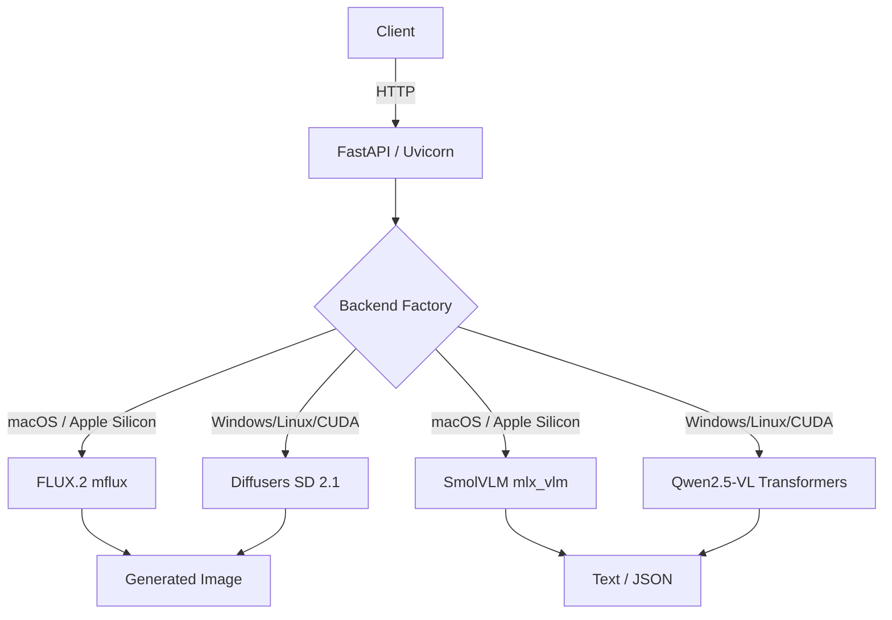

# Local Vision AI

Production-structured local multimodal AI for Apple Silicon.

## Purpose

Local Vision AI provides two local inference pipelines on your Mac:

1. **Text-to-Image** — Generate photorealistic images from prompts using **FLUX.2 [klein] 4B** (via MLX).
2. **Image-to-Text** — Analyze images, caption them, answer visual questions, and extract structured JSON using **SmolVLM 256M** (via MLX-VLM).

Everything runs on-device. No cloud API keys required.

## Architecture



## Platform Support

| Platform | Hardware | T2I Backend | I2T Backend | Notes |
|----------|----------|-------------|-------------|-------|
| **macOS** | Apple Silicon (M1–M4) | FLUX.2 klein 4B int4 | SmolVLM 256M int4 | Best quality, native MLX |
| **macOS** | Intel | SD 2.1 (Diffusers) | Qwen2.5-VL 3B | Slow, CPU-only |
| **Windows** | NVIDIA GPU (8GB+) | SD 2.1 (Diffusers) | Qwen2.5-VL 3B | CUDA accelerated |
| **Linux** | NVIDIA GPU (8GB+) | SD 2.1 (Diffusers) | Qwen2.5-VL 3B | CUDA accelerated |
| **Any** | CPU only | SD 1.5 (Diffusers) | Phi-3 Vision | Very slow, emergency fallback |

## Hardware Assumptions

- Apple Silicon Mac (M1/M2/M3+)
- macOS 14+
- **16 GB unified memory** (tested and confirmed working)
- No CUDA / NVIDIA hardware

## Installation

Requires **uv** (Python package manager) and **git**.

### Platform-Specific Setup

**macOS (Apple Silicon):**
```bash
cd local-vision-ai
make setup                    # installs uv deps + mflux + mlx
```

**Windows / Linux (NVIDIA GPU):**
```bash
cd local-vision-ai
uv venv --python 3.11
uv pip install -e ".[text_to_image,image_to_text,dev]"
# mlx/apple_silicon extras are skipped automatically on non-Apple platforms
```

Or manually:

```bash
uv venv --python 3.11
uv pip install -e ".[text_to_image,image_to_text,dev]"
cp .env.example .env
# Edit .env with your preferred settings
```

## Model Download

Download weights before running the API (avoids runtime stalls):

```bash
make download-models
```

Or:

```bash
bash scripts/download_models.sh
```

Models are cached to `./models/huggingface/`.

### Disk Space Required

| Model | Size | Notes |
|-------|------|-------|
| FLUX.2 [klein] 4B int4 | ~6–7 GB | T2I weights (primary) |
| SmolVLM 256M int4 | ~200 MB | I2T weights |
| Stable Diffusion 1.5 | ~5 GB | Legacy T2I fallback (optional) |

## Running the API

```bash
make run
```

Or:

```bash
HF_HOME=$(pwd)/models/huggingface \
  uv run python -m uvicorn api.main:app --host 0.0.0.0 --port 8000
```

## Example curl Commands

### Text-to-Image (FLUX.2)

**512×512 — fast, memory-safe (recommended)**

```bash
curl -X POST http://localhost:8000/v1/images/generate \
  -H "Content-Type: application/json" \
  -d '{
    "prompt": "A fierce cat and an angry dog fighting in a living room, dramatic lighting, detailed fur, photorealistic",
    "width": 512,
    "height": 512,
    "steps": 4,
    "guidance_scale": 1.0,
    "seed": 1337
  }'
```

**1024×1024 — higher quality, uses ~12 GB peak**

```bash
curl -X POST http://localhost:8000/v1/images/generate \
  -H "Content-Type: application/json" \
  -d '{
    "prompt": "A fierce cat and an angry dog fighting in a living room",
    "width": 1024,
    "height": 1024,
    "steps": 4,
    "guidance_scale": 1.0,
    "seed": 1337
  }'
```

**Direct CLI (no server needed)**

```bash
HF_HOME=$(pwd)/models/huggingface \
.venv/bin/mflux-generate-flux2 \
  --model mlx-community/FLUX.2-Klein-4B-4bit \
  --prompt "A fierce cat and an angry dog fighting" \
  --width 512 --height 512 --steps 4 --seed 1337 \
  --output outputs/text_to_image/my_image.png
```

### Image-to-Text (Analyze)

```bash
curl -X POST http://localhost:8000/v1/vision/analyze \
  -F "image=@sample.jpg" \
  -F "prompt=Describe this image in detail." \
  -F "response_format=text" \
  -F "max_tokens=512"
```

### Image-to-Text (Extract JSON)

```bash
curl -X POST http://localhost:8000/v1/vision/extract \
  -F "image=@sample.jpg" \
  -F "prompt=Extract the objects and colors as JSON." \
  -F "max_tokens=512"
```

## Memory Guidelines

| Resolution | Peak Memory | Safe on 16 GB? | Speed |
|------------|-------------|----------------|-------|
| **512×512** | ~4.5–5.5 GB | ✅ Yes (recommended) | ~30–40s |
| **1024×1024** | ~11–13 GB | ⚠️ Tight (ensure I2T unloaded) | ~60–70s |

**Rules:**
- Only **one** heavy pipeline is kept in memory at a time.
- The memory manager automatically unloads the previous pipeline before loading the next.
- Do not run other heavy apps (e.g., video editing, Xcode builds) during 1024×1024 generation.
- FLUX.2 runs in a **subprocess** via mflux, so the FastAPI process itself stays light.

## Backend Selection

Edit `config/text_to_image.yaml`:

```yaml
t2i:
  backend: "flux2"   # recommended — FLUX.2 [klein] 4B
  # or:
  backend: "sd15"    # legacy — Stable Diffusion 1.5 (smaller, lower quality)
```

Restart the API after changing config.

## Dataset Preparation

### Image-to-Text

Format (JSONL):

```json
{"image":"images/001.jpg","messages":[{"role":"user","content":"Describe this image."},{"role":"assistant","content":"A black sensor on a desk."}]}
```

Prepare and split:

```bash
uv run python -m training.image_to_text.prepare_dataset \
  --input-jsonl datasets/image_to_text/dataset.jsonl \
  --images-dir datasets/image_to_text/images
```

### Text-to-Image

Format (JSONL):

```json
{"file_name":"001.jpg","text":"A black smart sensor placed on a white desk"}
```

Prepare and split:

```bash
uv run python -m training.text_to_image.prepare_dataset \
  --input-jsonl datasets/text_to_image/metadata.jsonl \
  --images-dir datasets/text_to_image/images
```

## Fine-Tuning

### FLUX.2 LoRA (Text-to-Image)

`mflux` supports LoRA training natively. Configuration:

```json
{
  "training": {
    "base_model": "flux2-klein-4b",
    "model_id": "mlx-community/FLUX.2-Klein-4B-4bit",
    "quantize": 4,
    "lora": { "rank": 8, "alpha": 16, "dropout": 0.05 },
    "optimizer": { "type": "adamw", "learning_rate": 1e-4 },
    "training_params": {
      "batch_size": 1,
      "gradient_accumulation_steps": 4,
      "epochs": 1
    }
  }
}
```

Train:

```bash
.venv/bin/mflux-train \
  --base-model flux2-klein-4b \
  --config config/flux2_lora.json
```

### Image-to-Text (VLM LoRA)

```bash
# Smoke test first
make train-vlm-smoke

# Full run (if smoke test passes and memory is safe)
make train-vlm
```

## Evaluation

```bash
make evaluate-vlm
```

## Troubleshooting

| Issue | Likely Cause | Fix |
|-------|-------------|-----|
| `mflux not found` | mflux not installed | `uv pip install mflux` |
| `Peak MLX memory: 12.37 GB` | Normal for 1024×1024 | Reduce to 512×512 if needed |
| `MemoryError` | Model already loaded + another request | Wait for idle unload or restart API |
| Corrupt image upload | Wrong format or size | Use PNG/JPG under 10 MB |
| JSON parse failure from I2T | Model output raw text | Retry or tighten prompt |
| Slow first inference | MLX weight download in progress | Pre-download with `make download-models` |

## Replacing Selected Models

Edit `config/text_to_image.yaml` and `config/image_to_text.yaml`:

- **T2I:** Change `flux2.model_id` to another mflux-supported model (e.g., `mlx-community/FLUX.2-Klein-4B-8bit` for higher quality).
- **I2T:** Change `model_id` to any `mlx-community` quantized VLM (e.g., Qwen2.5-VL-3B, Gemma-3-4B).

Then run `make download-models` again.

## Moving Training to a Cloud NVIDIA GPU Later

1. Export the adapter:
   ```bash
   python -c "from peft import PeftModel; ..."
   ```
2. Upload the adapter + dataset to the cloud instance.
3. Install CUDA PyTorch (`torch>=2.2+cu121`).
4. Increase batch size (e.g., 4) and resolution (e.g., 768×768).
5. Run the same training scripts — they are framework-agnostic except for device config.

## License Considerations

- **FLUX.2 [klein] 4B:** Apache 2.0 (commercial-safe)
- **SmolVLM:** Apache 2.0
- **Stable Diffusion 1.5:** CreativeML Open RAIL-M (legacy)
- **Generated outputs:** Subject to model license terms; review before redistribution.

## Makefile Commands

| Command | Purpose |
|---------|---------|
| `make setup` | Create venv and install dependencies |
| `make audit` | Run environment audit script |
| `make download-models` | Download model weights |
| `make run` | Start API server |
| `make test` | Run pytest suite |
| `make benchmark` | Run benchmarks |
| `make train-vlm-smoke` | One-step VLM LoRA smoke test |
| `make train-vlm` | Full VLM LoRA training |
| `make evaluate-vlm` | Evaluate VLM adapter |
| `make clean-cache` | Remove generated cache files |

## Development

```bash
uv run pytest tests/ -v
uv run ruff check .
uv run mypy api/ services/ training/
```
